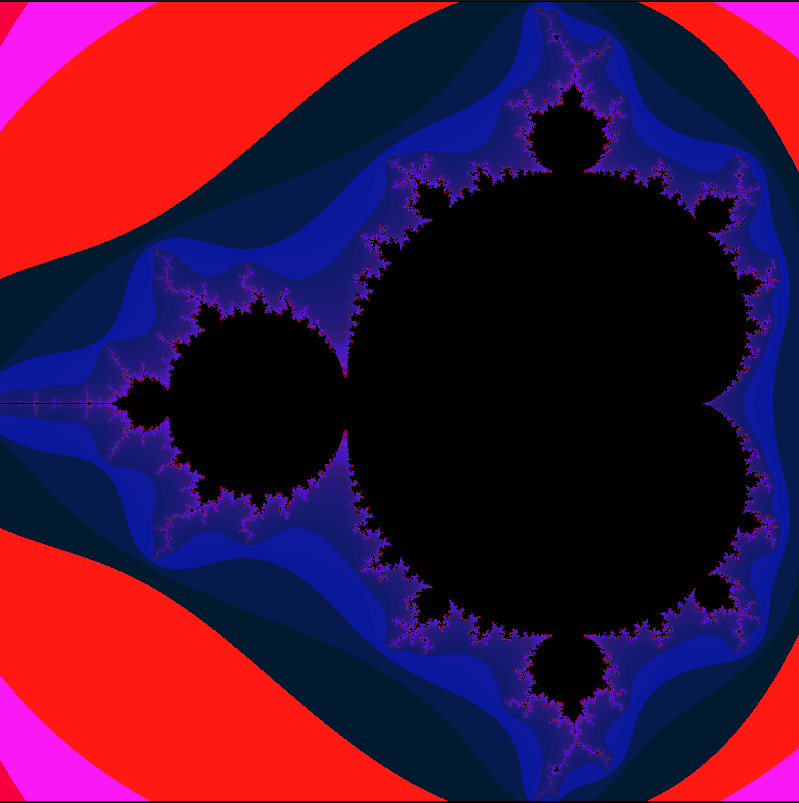
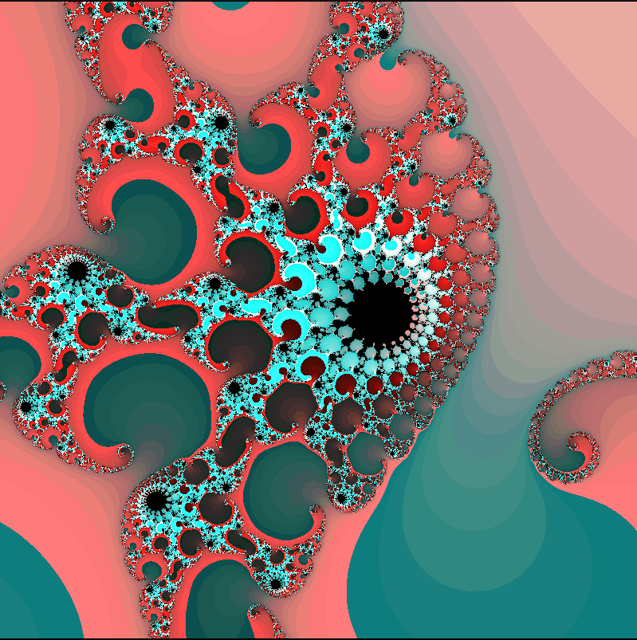
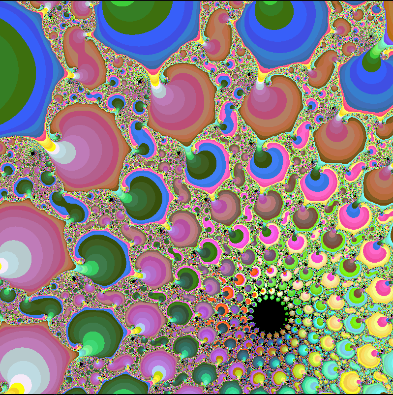

# Fract-ol

## It’s time for you to create a basic computer graphics project!
You are going to use the school graphical library: the MiniLibX! This library was
developed internally and includes basic necessary tools to open a window, create images
and deal with keyboard and mouse events.
This will be the opportunity for you to get familiar with the MiniLibX, to discover
or use the mathematical notion of complex numbers, to take a peek at the concept of
optimization in computer graphics and practice event handling.

Fractol is a mix between complex math and computational art modeling, it was a tough challenge that really made me understand more about data structures and stay aware of how a tiny change could influence the whole program.
Fractol is really entangled with the mathematical Chaos Theory and how you can observe beautiful patterns in the middle of the chaos.

Althought I had a glimpse of complex numbers once, some explanations were really essential for the development of this project:

[The Mandelbrot Set Explained](https://www.youtube.com/watch?v=7MotVcGvFMg)

[The Mandelbrot Fractal Explained!](https://www.youtube.com/watch?v=6IWXkV82oyY)

### As shown bellow, a huge variety of fractals can be generated with this program!

#### Mandelbrot Set

#### Julia Set

#### Phoenix

#### Extra images

